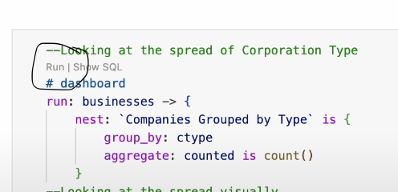

# Washington State Certified Public Accountants

## Overview

This dataset lists individuals who hold, or have held credentials from the Washington State Board of Accountancy. The Board of Accountancy provides this data to aid in verifying credentials and disciplinary history. There is a growing demand for CPAs in Washington state, which aligns with the nationwide trend of a growing demand for skilled accounting professionals due to a talent shortage in the field. However the Board does not guarantee the use of this information for any purpose and as such, the information obtained from this database should not be considered an official endorsement of any individual or firm. 

In WA, CPA licenses are valid for 3 years and must be renewed between January 1 and April 30. 

CPA mobility allows a licensed CPA from one state to practice in another state or to transfer your license to another state hence the data shows WA licensed CPAs being in different states and Countries. 

## Importance of the Data

This data provides valuable insights for regulatory bodies, businesses, CPA firms, job recruiters, policymakers, and even CPAs themselves. It helps track industry trends, ensure compliance, and inform business decisions. Such as: 

### 1. State Boards of Accountancy: 
Can monitor license holders to ensure compliance with Washington’s CPA requirements, even if they live out of state.
### 2. Renewal & Compliance Tracking:
Helps track how many CPAs maintain their license, even after relocating.

### 3. Mobility & Relocation Patterns: 
Understanding how many CPAs move out of Washington but keep their licenses helps assess workforce mobility.
### 4. Multi-State Practice: 
Identifies how many CPAs may be serving clients across different states, which is useful for firms expanding operations.

### 5.Recruitment & Talent Acquisition:
Employers can use this data to identify areas with high concentrations of CPAs for hiring purposes.
### Remote Work Trends: 
With remote work becoming more common, companies may look at this data to analyze where CPAs are practicing from.

### 6. License Status Verification: 
Ensures that CPAs representing themselves as Washington-licensed are actually in compliance.

## Data Source

The data is collected and maintained by the Washington State Open Data Portal. Each record represents the tindividuals who hold, or have held credentials from the Washington State Board of Accountancy. To inquire about any disciplinary actions taken against an individual or firm, please contact enforcement at (360) 664-9266. For all other inquiries, please contact customer service at (360) 753-2586.

## Malloy Code Files

This repository contains one Malloy code files:

- [complaints.malloynb](https://github.com/nmonareng/TSA-Complaints/blob/main/complaints.malloynb)

## Summary of Findings

### Number of active CPAs
The data shows that a total of 24,377 people currently hold an active WA CPA license from 1903 to present. Though these candidates hold the WA CPA license, only 52% are still in WA and the rest are in other States or Countries. This is as a result of CPA mobility, which allows CPA to use their licenses out of state. This dataset helps track how many CPAs maintain their license, even after relocating. 

### Growth in CPAs
WA has seen a steady growth in CPAs from 2005 to date, with 2022 peaking at 1,867 issued licenses. On March 17, 2022, Governor Inslee signed Senate Bill 5519 into law. The purpose of this legislation was to: Move the remaining CPA-Inactive Certificate holders to an inactive licensee status to remove the confusion surrounding the CPA-Inactive designation. This meant that individuals who held a CPA-Inactive Certificate could not hold out or practice public accounting during the time in which they were in an inactive status. This may have nudged a lot of people to renew their licenses.

### Mobility & Relocation Patterns
The AICPA has mutual recognition agreements (MRAs) with nine professional bodies of accounting in other parts of the world. This means that a US CPA license enables you to practice accounting in these international countries. 
- South Africa
- Australia
- New Zealand
- Canada
- Hong Kong
- Ireland
- Mexico
- Scotland

### Majority (48%) practice in Japan followed by South Korea at 17%, this shows that the CPA license allows for relocation and growth. 

# How to Open a Shared GitHub File and Run Malloy Code
To explore the data and run the analyses:

## 1. Open the Shared GitHub File 

Click on the https://github.com/nmonareng/TSA-Complaints provided to access the shared repository or file. 

Once on Github, click Shift + period this will load the web editor. Then install the malloy extension. See images below for reference:
| **Step**   | **Image Preview** |
|--------|-----------|
| `Step 1 - Press allow` |  |
| `Step 2 - Click the Blocks, search for Malloy, install` |  |
| `Step 3 - Click Trust` |  |
| `Step 4 - Click a .malloynb file` |  |
| `Step 5 - Press Run` |  |

## License

This dataset is provided for educational and research purposes. The Github data files and codes have been generated by Nobuhle Lisa Monareng for Gonzaga University Graduate School of Business as part of the MSBA-622-01 Data Science for Business (Spring 2025) course. The [Washington State Accountancy Board](https://acb.wa.gov/) owns all licenses to this data. 

## Contact

For questions or more information, please contact the [Washington State Accountancy Board](https://acb.wa.gov/)

